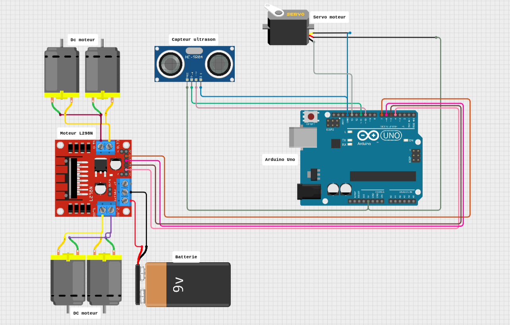
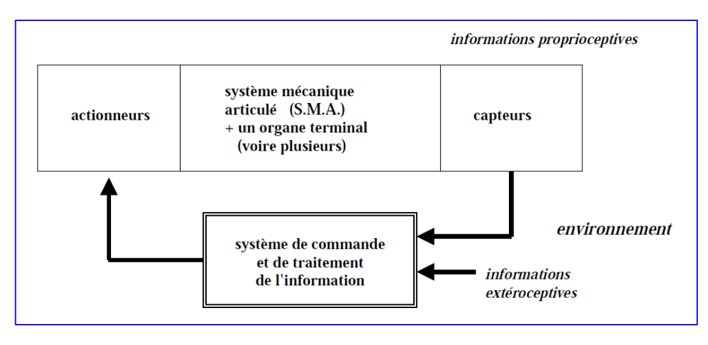

# Robot Évitement d'Obstacles avec la carte Arduino

## Auteur
Elkhoulati Yahya

## Aperçu du Projet

Ce projet consiste en la conception d'un robot autonome capable d'éviter les obstacles grâce à un capteur ultrason HC-SR04. Le robot utilise un Arduino Uno, deux moteurs DC avec un module L298N, un servomoteur pour scanner l'environnement et un capteur à ultrasons pour détecter les obstacles.

### Objectifs

- Développer un robot autonome capable de détecter et d’éviter les obstacles sans intervention humaine.
- Intégrer et programmer les composants électroniques (Arduino, capteur ultrason, servomoteur et moteurs DC) pour assurer une navigation fluide.
- Optimiser le comportement du robot en ajustant les paramètres du capteur et des moteurs pour améliorer sa réactivité et son efficacité.

---

## Composants

- **Arduino Uno**
- **Module L298N**
- **Capteur ultrason HC-SR04**
- **Servomoteur SG90**
- **Autres Matériaux** : Batteries, fils de connexion et source d'alimentation.

---

## Schéma de Câblage

### 1. Connexion Directe



### 2. Avec Affichage LCD



---

### Fonctionnalités

- Détection d'obstacles: Utilisation du capteur ultrason HC-SR04 pour mesurer la distance aux obstacles.
- Évitement automatique: Le robot s'arrête, analyse son environnement et choisit la meilleure direction.
- Rotation du capteur: Le servomoteur permet d'orienter le capteur pour scanner la zone devant le robot.
- Déplacement intelligent: Le robot avance, recule ou tourne en fonction des distances mesurées.
- Affichage des données: Les distances détectées sont envoyées et affichées dans le moniteur série Arduino.

### Exemple de Code

```cpp
#include <HCSR04.h>
#include <Servo.h>
// Définition des broches du moteur (L298N)
#define ENA 9  
#define IN1 8  
#define IN2 7  
#define ENB 6  
#define IN3 5  
#define IN4 4  
// Définition des broches du capteur ultrason
const int trigPin = 2;
const int echoPin = 3;
UltraSonicDistanceSensor distanceSensor(trigPin, echoPin);
Servo myservo; // Servomoteur
int distance;
void setup() {
    Serial.begin(9600);
    pinMode(ENA, OUTPUT);
    pinMode(ENB, OUTPUT);
    pinMode(IN1, OUTPUT);
    pinMode(IN2, OUTPUT);
    pinMode(IN3, OUTPUT);
    pinMode(IN4, OUTPUT);
    myservo.attach(10);
    myservo.write(90);
}
void loop() {
    distance = distanceSensor.measureDistanceCm();
    Serial.print("Distance : ");
    Serial.println(distance);
    if (distance < 15 && distance > 0) {
        arreter();
        delay(500);
        reculer();
        delay(500);
        arreter();
    } else {
        avancer();
    }
}
// Fonctions de contrôle
void avancer() {
    digitalWrite(IN1, HIGH);
    digitalWrite(IN2, LOW);
    digitalWrite(IN3, HIGH);
    digitalWrite(IN4, LOW);
    analogWrite(ENA, 150);
    analogWrite(ENB, 150);
}
void reculer() {
    digitalWrite(IN1, LOW);
    digitalWrite(IN2, HIGH);
    digitalWrite(IN3, LOW);
    digitalWrite(IN4, HIGH);
    analogWrite(ENA, 150);
    analogWrite(ENB, 150);
}
void arreter() {
    digitalWrite(IN1, LOW);
    digitalWrite(IN2, LOW);
    digitalWrite(IN3, LOW);
    digitalWrite(IN4, LOW);
}
```

---

## Exécution du Projet

### Étapes

1. Assembler les composants en connectant le module L298N, les moteurs, le capteur HC-SR04 et le servomoteur à l’Arduino.
2. Téléverser le code dans l’IDE Arduino, sélectionner la carte et le port, puis l’envoyer vers l’Arduino.
3. Alimenter le robot avec une batterie externe et vérifier que tous les composants fonctionnent correctement.
4. Tester et ajuster les distances de détection et la vitesse des moteurs pour améliorer la navigation du robot.

### Résultats Clés

- Le robot détecte les obstacles grâce au capteur ultrason HC-SR04 et ajuste sa trajectoire.
- Il utilise un servomoteur pour analyser les directions possibles et choisir le meilleur chemin.
- Les moteurs contrôlés par le module L298N permettent au robot d’avancer, reculer et éviter les obstacles en toute autonomie.

---

## Applications

- **Robotique mobile** : Utilisé pour concevoir des robots autonomes capables d'éviter les obstacles.
- **Domotique** : Peut être adapté pour des systèmes de surveillance ou d'assistance à la navigation dans les maisons intelligentes..
- **Éducation et apprentissage** : Idéal pour initier les étudiants à la programmation et au contrôle des moteurs avec Arduino.
- **Exploration et cartographie**: Peut être intégré dans des robots explorateurs pour naviguer dans des environnements inconnus.

---

## Informations sur le Dépôt

### Structure du Projet

```
📂 Robot-Evitement-Obstacle
├── README.md
├── Docs
│   └── Présentation.pdf
├── Code
│   └── robot_evitent_obstacle.ino
├── Images
│   ├── Schema_electronique.png
│   ├── Schema_synoptique.png
└── Licence
```

### Comment Lancer le Projet

1. Clonez ce dépôt.
2. Téléversez le code Arduino sur votre carte.
3. Suivez les schémas de câblage pour connecter les composants.
4. Testez le robot et observez son comportement en évitant les obstacles.

---

## Conclusion

Ce projet de robot évitant les obstacles met en œuvre des concepts clés de la robotique et de l’embarqué. Grâce à l'Arduino Uno, au capteur ultrason HC-SR04, au module L298N et au servomoteur, le robot est capable de détecter et contourner les obstacles de manière autonome.
Il constitue une excellente base pour approfondir l’apprentissage en programmation Arduino, en contrôle des moteurs, et en détection d’obstacles, tout en ouvrant la voie à des améliorations comme l’ajout d’une intelligence artificielle ou d’un module de communication.

**Lien vers le Dépôt GitHub :** [https://github.com/ElkhoulatiYahya/Robot-Evite-Obstacle]


